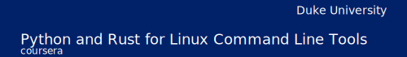

# 

# Python and Rust CLI tools course

This is the Introduction to Command-line tools with Python and Rust course. You'll learn several techniques and tools to build powerful command-line tools in both Python and Rust. From the fundamentals to more robust best-practices and advanced topics, you'll be able to start automating your daily tasks and build your own CLI tools.

Building command-line tools to automate and simplify workflows is a foundational principle of DevOps. Regardless of your expertise in either Python or Rust, you'll be able to build on the examples in this course. This course does not require you to be an expert in either languages, and most examples can be adapted to your own needs.

💡 Are you just looking for a 👉 [Rust template](https://github.com/alfredodeza/rust-template) to get started easily with a project? The [template](https://github.com/alfredodeza/rust-template) has everything you need!

This is part 1 of the Python and Rust CLI tools course. There are 2 weeks in total:

- [1: Resources](https://github.com/alfredodeza/python-and-rust-tools) 👈 You are here!
- [2: Python CLI](https://github.com/alfredodeza/python-cli-example)
- [3: Rust CLI](https://github.com/alfredodeza/rust-cli-example)
- [4: Python Advanced CLI](https://github.com/alfredodeza/advanced-python-cli) 
- [5: Rust Advanced CLI](https://github.com/alfredodeza/advanced-rust-cli)

🚀 **Watch the Video course**

## Learning Objectives

1. Generate functional command-line tools in both Python and Rust.
1. Develop complex command-line tools by adding sub-commands, flags, and environment variables.
1. Design and implement Linux-style command-line tools.
1. Package and distribute command-line tools for use by others.
1. Apply testing methods to validate the behavior of command-line tools

## Prerequisites
The course will use [Visual Studio Code](https://code.visualstudio.com/?WT.mc_id=academic-0000-alfredodeza) as the editor of choice. You can use any editor you like, but the course will focus on VSCode. These are the extensions you'll need to install:

- [Visual Studio Code](https://code.visualstudio.com/?WT.mc_id=academic-0000-alfredodeza)
- [Python extension for Visual Studio Code](https://marketplace.visualstudio.com/items?itemName=ms-python.python&WT.mc_id=academic-0000-alfredodeza)
- [GitHub Copilot](https://marketplace.visualstudio.com/items?itemName=GitHub.copilot&WT.mc_id=academic-0000-alfredodeza)
- [Rust Analyzer](https://marketplace.visualstudio.com/items?itemName=rust-lang.rust-analyzer&WT.mc_id=academic-0000-alfredodeza)

For Python, I recommend you use your system Python as long as it is newer than 3.6, and that you use the Python `venv` module for virtual environments (the course will go into details on how to do this). For Rust you'll need to install the [Rust toolchain](https://rustup.rs/). 

This course uses [GitHub Copilot](https://copilot.github.com/) and [GitHub Codespaces](https://github.com/features/codespaces) which in turn uses Visual Studio Code. Using Copilot and Codespaces creates a normalized way to develop and allows you to learn while you practice using generated suggestions.

## Week 1: Introduction to Command-line tools
This week you'll learn the basics of command-line tools, and how to build a simple tool in Python and Rust. These are the repositories you should use as a reference:

- [Python CLI examples](https://github.com/alfredodeza/python-cli-example)
- [Rust CLI examples](https://github.com/alfredodeza/rust-cli-example)

## Week 2: Advanced Command-line tool development

In this week, you'll build on the basics of CLI tools and add more complex flags with values and sub-commands.

- [Advanced Python CLI](https://github.com/alfredodeza/advanced-python-cli) 
- [Advanced Rust CLI](https://github.com/alfredodeza/advanced-rust-cli)
